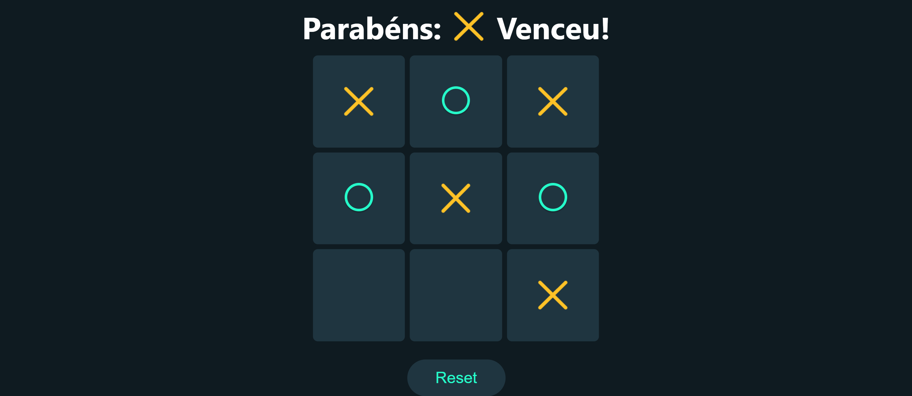

# Jogo da Velha React
<p>Jogo da velha desenvolvido em React JS.</p>
<p>Para ver o site funcionando use o comando <b>npm start</b> no terminal ou acesse o site pelo link: <a href="https://jogo-da-velha-reactjs.vercel.app/" target="_blank">Jogo da Velha React</a></p>



<br>

## Tecnologias utilizadas
<table>
  <tr>
    <td width="50">
      
    </td>
    <td>
      HTML: Estrutura da página web
    </td>
  </tr>

  <tr>
    <td width="50">
      
    </td>
    <td>
      CSS: Estilo da página web
    </td>
  </tr>

  <tr>
    <td width="50">
      
    </td>
    <td>
      JavaScript: Comportamento da página web
    </td>
  </tr>

  <tr>
    <td width="50">
      
    </td>
    <td>
      React JS: Biblioteca JavaScript Front-End
    </td>
  </tr>

  <tr>
    <td width="50">
      
    </td>
    <td>
      Create React App: Criação do projeto
    </td>
  </tr>

</table>

## Vídeo tutorial
```
https://www.youtube.com/watch?v=lYtPscvwgP4
```